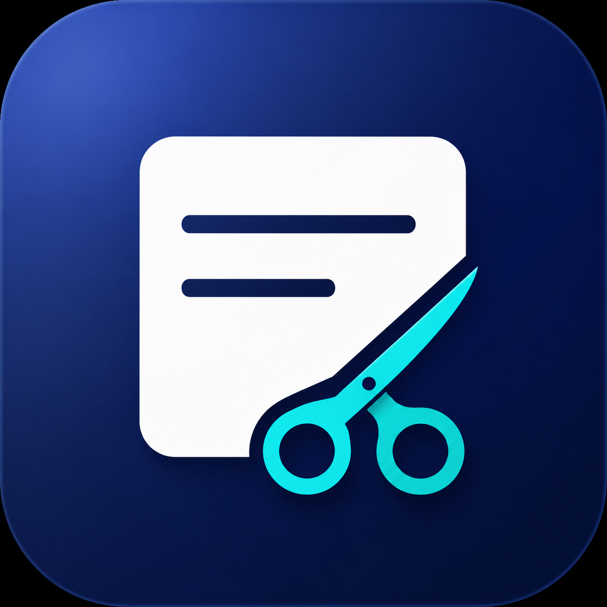

<div align="center">

[日本語](README.md) | **English**



# twedel

**A Windows app for safely cleaning up your X (formerly Twitter) posts**

Fetch regular posts, replies, reposts, and likes together, then filter and clean them up by date or type. No development tools or complicated setup are required.

[**Download for Windows**](https://github.com/ninjin0802/twedel/releases/latest) · [User guide (Japanese)](docs/USER_GUIDE.md) · [Troubleshooting (Japanese)](docs/TROUBLESHOOTING.md) · [Support development](https://ofuse.me/ninjin)

[](https://github.com/ninjin0802/twedel/actions/workflows/windows-build.yml)
[](https://github.com/ninjin0802/twedel/releases/latest)


[](LICENSE)

</div>

> [!CAUTION]
> **twedel uses an unofficial internal API intended for the X web client, not the official X API.**
> Its use may be considered a violation of the X Terms of Service and may result in breakage after X changes, access restrictions, temporary account locks, or suspension. Use it at your own risk. The developer cannot cover account restrictions or data loss.
>
> The app cannot be used until you acknowledge this risk on first launch. In the Windows app, saved `auth_token` and `ct0` values are encrypted with Windows DPAPI through Electron `safeStorage`; normally, only the Windows user who saved them can decrypt them. Renderer-to-backend actions use Electron IPC. Credentials are never sent to the developer or to an external server other than X.
>
> Deleted posts cannot be restored. Download an archive of any data you need from X before deleting it.

## Getting started

1. Open the [latest Release page](https://github.com/ninjin0802/twedel/releases/latest).
2. Download `twedel-Setup-<version>.exe` from Assets.
3. Run the installer and start twedel.
4. Sign in to X in the dedicated Chrome window and fetch the posts you want to manage.

> Node.js, npm, and Git are not required. The installer contains the necessary runtime.

## Features

| Fetch and manage | Filter and protect | Desktop app |
|---|---|---|
| Fetch posts, replies, reposts, and likes together | Filter by date, keyword, type, and engagement | Save and switch between multiple X accounts |
| Import older posts from an X archive ZIP | Review counts, breakdown, and content before deletion | Resume interrupted operations |
| Remove completed items from the list automatically | Protect posts separately for each account | Update automatically from inside the app |
| Protect pinned posts during live fetches | Do not retain deleted text or outcomes in history | Clean unnecessary dedicated-Chrome caches |

## Basic workflow

```text
Connect to X → Fetch posts and likes → Filter → Select → Review → Delete
```

1. Sign in to X using the dedicated Chrome window opened by twedel.
2. Check the account card and select Fetch.
3. Filter the list by date, keyword, type, or other criteria.
4. Protect anything you want to keep with the lock button at the right of its row.
5. Select the deletion targets and review the count and breakdown.
6. Start deletion when everything looks correct.

The app interface can be switched between Japanese and English from the language selector in the sidebar. Your choice is saved locally.

## Requirements

| Item | Requirement |
|---|---|
| OS | Windows 10 or 11, 64-bit |
| CPU | 64-bit Intel or AMD processor |
| Memory | 4 GB minimum; 8 GB recommended |
| Free space | 500 MB or more |
| Browser | Latest Google Chrome |
| Network | Required to connect to X and download updates |
| Account | The X account whose content you want to manage |

Google Chrome is used for X sign-in and credential acquisition. twedel uses a dedicated profile and does not affect your regular Chrome profile. Automatic acquisition is unavailable on systems with only Microsoft Edge or Firefox.

## Security and privacy

- X credentials, account information, and protected post IDs stay on your PC.
- There is no feature that sends credentials to the developer.
- The internal local API is bound to `127.0.0.1` and authenticated with a per-launch secret.
- Electron sandboxing and context isolation are enabled; external sites cannot invoke app operations.
- Deleted post text and deletion results are not retained as history logs.
- Temporary resume data is removed after an operation completes.
- Switching accounts resets the list and selection to prevent actions against the wrong account.
- Chrome login cookies are retained while HTTP, Service Worker, and GPU caches are cleaned.

[Privacy policy (Japanese)](PRIVACY.md) · [Security policy](SECURITY.md)

## Automatic updates

When a new version is available, the app shows its version and release notes. Select “Download and update” to see download progress; the update is installed in the background and the app restarts afterward.

## Code signing

Free code signing provided by [SignPath.io](https://signpath.io/), certificate by [SignPath Foundation](https://signpath.org/).

Approval from the SignPath Foundation is currently pending. Until signing becomes available, each Release clearly identifies the installer as unsigned. Build provenance and the signing process are documented in the [code signing policy](CODE_SIGNING_POLICY.md).

## Troubleshooting

See the [troubleshooting guide (Japanese)](docs/TROUBLESHOOTING.md) if Chrome credentials cannot be acquired, fetching stalls or returns zero items, an HTTP error appears, updating fails, or older content is missing from live results.

Older content that X no longer returns in a live timeline can be loaded from an X archive ZIP using “Other source.”

Report bugs through [GitHub Issues](https://github.com/ninjin0802/twedel/issues). Never post credentials or cookies.

## Support development

twedel is open source, and every feature remains free. Voluntary support helps with testing, maintenance, and new development; it never changes the features available to you.

### [Support twedel on OFUSE](https://ofuse.me/ninjin)

## Developer

<table>
<tr>
<td width="96"></td>
<td><strong>ninjin</strong> — <a href="https://x.com/_nin82">X: @_nin82</a><br>Independent developer of twedel, working toward a simple and convenient tool that feels safe enough to use personally.</td>
</tr>
</table>

- License: [MIT License](LICENSE)
- Development, testing, and architecture: [Development guide](docs/DEVELOPMENT.md)
- Signing application status: [SignPath application guide](docs/SIGNPATH_APPLICATION.md)
- Mandatory release process: [Update rules](UPDATE_RULES.md)

## Uninstalling

Open Windows Settings → Apps → Installed apps, select `twedel`, and choose Uninstall. To remove locally saved credentials as well, use “Reset account settings” in twedel before uninstalling.
